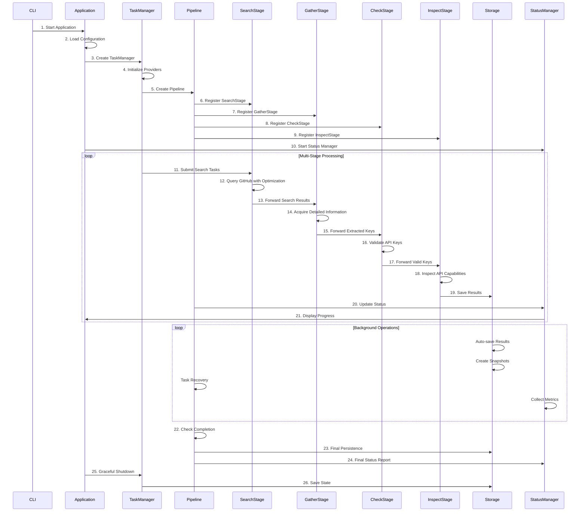

# Harvester - Universal Data Acquisition Framework

**📖 [中文文档](README.zh-CN.md) | English | 🔗 [More Tools](https://github.com/wzdnzd/ai-collector)**

A universal, adaptive data acquisition framework designed for comprehensive information acquisition from multiple sources including GitHub, network mapping platforms (FOFA, Shodan), and arbitrary web endpoints. While the current implementation focuses on AI service provider key discovery as a practical example, the framework is architected for extensibility to support diverse data acquisition scenarios.

---

⭐⭐⭐ **If this project helps you, please give it a star!** Your support motivates us to keep improving and adding new features.

---

## Table of Contents

- [Key Features](#key-features)
- [Quick Start](#quick-start)
- [Architecture](#architecture)
- [Directory Structure](#directory-structure)
- [Troubleshooting](#troubleshooting)
- [Contributing](#contributing)

## Project Goals

The system aims to build a **universal data acquisition framework** primarily targeting:

- **GitHub**: Code repositories, issues, commits, and API endpoints
- **Network Mapping Platforms**: 
  - [FOFA](https://fofa.info) - Cyberspace mapping and asset discovery
  - [Shodan](https://www.shodan.io/) - Internet-connected device search engine
- **Arbitrary Web Endpoints**: Custom APIs, web services, and data sources
- **Extensible Architecture**: Plugin-based system for easy integration of new data sources

## Current Data Source Support

| Data Source | Status        | Description                             |
| ----------- | ------------- | --------------------------------------- |
| GitHub API  | ✅ Implemented | Full API integration with rate limiting |
| GitHub Web  | ✅ Implemented | Web scraping with intelligent parsing   |
| FOFA        | 🚧 Planned     | Cyberspace asset discovery integration  |
| Shodan      | 🚧 Planned     | IoT and network device enumeration      |
| Custom APIs | 🚧 Planned     | Generic REST/GraphQL API adapter        |

### Current AI Provider Scan Presets

| Provider | `provider_type` | Discovery Pattern | Validation | Notes |
| -------- | --------------- | ----------------- | ---------- | ----- |
| OpenAI / OpenAI-compatible | `openai`, `openai_like` | `sk...T3BlbkFJ...` style API keys | Chat completion probe | `openai_like` supports custom OpenAI-compatible endpoints |
| NVIDIA NIM | `openai_like` | `nvapi-...` API keys | OpenAI-compatible chat completion probe and `/v1/models` | Uses `https://integrate.api.nvidia.com/v1` |
| Cerebras | `cerebras` | `csk-...` API keys | `/v1/models` | Default base URL: `https://api.cerebras.ai/v1` |
| OpenRouter | `openrouter` | `sk-or-v1-...` API keys | `/api/v1/key` metadata | Adds `X-Title: harvester` during validation |
| Groq | `groq` | `gsk_...` API keys | `/openai/v1/models` | OpenAI-compatible validation path |
| Grok Web/SSO | `grok` | `grok.com` / `x.ai` token assignments and session-cookie traces | Manual browser-context check | Intentionally does not scan the `xai-` API-key prefix by default |
| Gemini | `gemini` | `AIza...` API keys | `generativelanguage.googleapis.com/v1beta/models` | Uses `x-goog-api-key` |
| Tavily | `tavily` | `tvly-...` / `tavily-...` API keys | `/usage` metadata | Uses `Authorization: Bearer`; inspect stores usage audit fields |
| DeepSeek | `deepseek` | `sk-...` API keys | `GET /models` gate + minimal chat-completion probe (`max_tokens=1`) to surface 402 | Default base URL: `https://api.deepseek.com`; 401 body may be non-JSON; zero-balance keys map to `no-quota-keys.txt` |
| Kimi / Moonshot | `kimi` | `sk-...` API keys | `GET /v1/models` | Default base URL: `https://api.moonshot.cn/v1`; quotas map to `no-quota-keys.txt` |
| GLM / Zhipu | `glm` | `{id}.{secret}` dot-form API keys | Chat completion probe (`glm-4.7-flash`) | Default base URL: `https://open.bigmodel.cn/api/paas/v4`; no `/models` endpoint, so inspect is skipped |
| Xiaomi MiMo | `mimo` | `tp-...` / `sk-...` API keys | `GET /models` | Default base URL: `https://token-plan-cn.xiaomimimo.com/v1` (CN); regional clusters per task (`token-plan-sgp.xiaomimimo.com/v1` for Singapore) |
| Alibaba Qwen (DashScope) | `qwen` | `sk-...` API keys | `GET /models` + chat probe | Default base URL: `https://dashscope.aliyuncs.com/compatible-mode/v1` (CN); `dashscope-intl.aliyuncs.com` for international; zero-balance is HTTP 400 + `code: Arrearage` (mapped to no-quota) |
| ModelScope (魔搭) | `modelscope` | `MODELSCOPE_API_KEY` / `MODELSCOPE_SDK_TOKEN` tokens (no fixed prefix) | Chat completion probe (models list is public, not gated) | Default base URL: `https://api-inference.modelscope.cn/v1`; single CN endpoint |

## Architecture

### Layered Architecture

```mermaid
graph TB
    %% Entry Layer
    subgraph Entry["Entry Layer"]
        CLI["CLI Interface<br/>(main.py)"]
        App["Application Core<br/>(main.py)"]
    end

    %% Management Layer
    subgraph Management["Management Layer"]
        TaskMgr["Task Manager<br/>(manager/task.py)"]
        Pipeline["Pipeline Manager<br/>(manager/pipeline.py)"]
        WorkerMgr["Worker Manager<br/>(manager/worker.py)"]
        QueueMgr["Queue Manager<br/>(manager/queue.py)"]
        StatusMgr["Status Manager<br/>(manager/status.py)"]
        Shutdown["Shutdown Coordinator<br/>(manager/shutdown.py)"]
    end

    %% Processing Layer
    subgraph Processing["Processing Layer"]
        StageBase["Stage Framework<br/>(stage/base.py)"]
        StageImpl["Stage Implementations<br/>(stage/definition.py)"]
        StageReg["Stage Registry<br/>(stage/registry.py)"]
        StageFactory["Stage Factory<br/>(stage/factory.py)"]
        StageResolver["Dependency Resolver<br/>(stage/resolver.py)"]
    end

    %% Service Layer
    subgraph Service["Service Layer"]
        SearchSvc["Search Service<br/>(search/client.py)"]
        SearchProviders["AI Provider Implementations<br/>(provider/)"]
        RefineSvc["Query Refinement<br/>(refine/)"]
        RefineEngine["Refine Engine<br/>(refine/engine.py)"]
        RefineOptimizer["Query Optimizer<br/>(refine/optimizer.py)"]
    end

    %% Core Domain Layer
    subgraph Core["Core Domain Layer"]
        Models["Domain Models & Tasks<br/>(core/models.py)"]
        Types["Type System<br/>(core/types.py)"]
        Enums["Enumerations<br/>(core/enums.py)"]
        Metrics["Metrics<br/>(core/metrics.py)"]
        Auth["Authentication<br/>(core/auth.py)"]
    end

    %% Infrastructure Layer
    subgraph Infrastructure["Infrastructure Layer"]
        Config["Configuration<br/>(config/)"]
        Tools["Tools & Utilities<br/>(tools/)"]
        Constants["Constants<br/>(constant/)"]
        Storage["Storage & Persistence<br/>(storage/)"]
    end

    %% State Management Layer
    subgraph StateLayer["State Management Layer"]
        StateCollector["State Collector<br/>(state/collector.py)"]
        StateDisplay["Display Engine<br/>(state/display.py)"]
        StateBuilder["Status Builder<br/>(state/builder.py)"]
        StateModels["State Models<br/>(state/models.py)"]
        StateMonitor["State Monitor<br/>(state/monitor.py)"]
        StateEnums["State Enums<br/>(state/enums.py)"]
        StateTypes["State Types<br/>(state/types.py)"]
    end

    %% External Systems
    subgraph External["External Systems"]
        GitHub["GitHub<br/>(API + Web)"]
        AIServices["AI Service<br/>Providers"]
        FileSystem["File System<br/>(Local Storage)"]
    end

    %% Dependencies (Top-down)
    Entry --> Management
    Management --> Processing
    Processing --> Service
    Service --> Core

    %% Infrastructure dependencies
    Entry -.-> Infrastructure
    Management -.-> Infrastructure
    Processing -.-> Infrastructure
    Service -.-> Infrastructure
    Core -.-> Infrastructure

    %% State management dependencies
    Entry -.-> StateLayer
    Management -.-> StateLayer

    %% External dependencies
    Service --> External
    Infrastructure --> External
```



### System Architecture Overview

```mermaid
graph TB
    %% User Interface Layer
    subgraph UserLayer["User Interface Layer"]
        User[User]
        CLI[Command Line Interface]
        ConfigMgmt[Configuration Management]
    end

    %% Application Management Layer
    subgraph AppLayer["Application Management Layer"]
        MainApp[Main Application]
        TaskManager[Task Manager]
        StatusManager[Status Manager]
        ResourceManager[Resource Manager]
        ShutdownManager[Shutdown Manager]
    end

    %% Core Pipeline Engine
    subgraph PipelineCore["Pipeline Engine"]
        %% Stage Management System
        subgraph StageSystem["Stage Management System"]
            StageRegistry[Stage Registry]
            DependencyResolver[Dependency Resolver]
            StageFactory[Stage Factory]
        end

        %% Queue Management System
        subgraph QueueSystem["Queue Management System"]
            QueueManager[Queue Manager]
            WorkerManager[Worker Manager]
            MonitoringSystem[System Monitor]
        end

        %% Processing Stages
        subgraph ProcessingStages["Processing Stages"]
            SearchStage[Search Stage]
            GatherStage[Gather Stage]
            CheckStage[Check Stage]
            InspectStage[Inspect Stage]
        end
    end

    %% Search Provider Ecosystem
    subgraph ProviderEcosystem["Search Provider Ecosystem"]
        ProviderRegistry[Provider Registry]
        BaseProvider[Base Provider]
        OpenAIProvider[OpenAI-like Provider]
        CustomProviders[Custom Providers]
    end

    %% Advanced Processing Engines
    subgraph ProcessingEngines["Processing Engines"]
        SearchClient[Search Client]

        %% Query Optimization Engine
        subgraph QueryOptimizer["Query Optimization Engine"]
            RefineEngine[Refine Engine]
            RegexParser[Regex Parser]
            SplittabilityAnalyzer[Splittability Analyzer]
            EnumerationOptimizer[Enumeration Optimizer]
            QueryGenerator[Query Generator]
            OptimizationStrategies[Optimization Strategies]

            %% Internal Flow
            RefineEngine --> RegexParser
            RegexParser --> SplittabilityAnalyzer
            SplittabilityAnalyzer --> EnumerationOptimizer
            EnumerationOptimizer --> OptimizationStrategies
            OptimizationStrategies --> QueryGenerator
        end

        ValidationEngine[API Key Validation]
        RecoveryEngine[Task Recovery]
    end

    %% State & Data Management
    subgraph StateManagement["State & Data Management"]
        StateCollector[State Collector]
        DisplayEngine[Display Engine]
        StatusBuilder[Status Builder]
        StateMonitor[State Monitor]
        PersistenceLayer[Persistence Layer]
        SnapshotManager[Snapshot Manager]
        ResultManager[Result Manager]
    end

    %% Infrastructure Services
    subgraph Infrastructure["Infrastructure Services"]
        RateLimiting[Rate Limiting]
        CredentialMgmt[Credential Management]
        AgentRotation[User Agent Rotation]
        LoggingSystem[Logging System]
        RetryFramework[Retry Framework]
        ResourcePool[Resource Pool]
    end

    %% External Systems
    subgraph External["External Systems"]
        GitHubAPI[GitHub API]
        GitHubWeb[GitHub Web Interface]
        AIServiceAPIs[AI Service APIs]
        FileSystem[Local File System]
    end

    %% User Interactions
    User --> CLI
    User --> ConfigMgmt
    CLI --> MainApp
    ConfigMgmt --> MainApp

    %% Application Flow
    MainApp --> TaskManager
    MainApp --> StatusManager
    MainApp --> ResourceManager
    MainApp --> ShutdownManager
    TaskManager --> StageRegistry
    TaskManager --> QueueManager

    %% Stage Management Flow
    StageRegistry --> DependencyResolver
    StageRegistry --> StageFactory
    DependencyResolver --> ProcessingStages
    StageFactory --> ProcessingStages

    %% Queue Management Flow
    QueueManager --> WorkerManager
    QueueManager --> MonitoringSystem
    WorkerManager --> ProcessingStages

    %% Stage Dependencies (Pipeline)
    SearchStage --> GatherStage
    GatherStage --> CheckStage
    CheckStage --> InspectStage

    %% Processing Engine Integration
    SearchStage --> SearchClient
    SearchStage --> QueryOptimizer
    CheckStage --> ValidationEngine
    ProcessingStages --> RecoveryEngine

    %% Provider Integration
    SearchClient --> ProviderRegistry
    ProviderRegistry --> BaseProvider
    BaseProvider --> OpenAIProvider
    BaseProvider --> CustomProviders

    %% State Management Integration
    ProcessingStages --> StateCollector
    QueueManager --> StateCollector
    StateCollector --> DisplayEngine
    StateCollector --> StatusBuilder
    StateMonitor --> DisplayEngine
    ProcessingStages --> PersistenceLayer
    PersistenceLayer --> SnapshotManager
    PersistenceLayer --> ResultManager

    %% Infrastructure Integration
    SearchClient -.-> RateLimiting
    ResourceManager -.-> CredentialMgmt
    ResourceManager -.-> AgentRotation
    MainApp -.-> LoggingSystem
    ProcessingStages -.-> RetryFramework
    Infrastructure -.-> ResourcePool

    %% External Connections
    SearchClient --> GitHubAPI
    SearchClient --> GitHubWeb
    ValidationEngine --> AIServiceAPIs
    PersistenceLayer --> FileSystem

    %% Styling
    classDef userClass fill:#e3f2fd,stroke:#1976d2,stroke-width:2px
    classDef appClass fill:#f3e5f5,stroke:#7b1fa2,stroke-width:2px
    classDef coreClass fill:#e8f5e8,stroke:#388e3c,stroke-width:3px
    classDef providerClass fill:#fff3e0,stroke:#f57c00,stroke-width:2px
    classDef engineClass fill:#fce4ec,stroke:#c2185b,stroke-width:2px
    classDef stateClass fill:#f1f8e9,stroke:#689f38,stroke-width:2px
    classDef infraClass fill:#f5f5f5,stroke:#616161,stroke-width:2px
    classDef externalClass fill:#ffebee,stroke:#d32f2f,stroke-width:2px

    class User,CLI,ConfigMgmt userClass
    class MainApp,TaskManager,StatusManager,ResourceManager,ShutdownManager appClass
    class StageRegistry,DependencyResolver,StageFactory,QueueManager,WorkerManager,MonitoringSystem,SearchStage,GatherStage,CheckStage,InspectStage coreClass
    class ProviderRegistry,BaseProvider,OpenAIProvider,CustomProviders providerClass
    class SearchClient,QueryOptimizer,ValidationEngine,RecoveryEngine engineClass
    class StateCollector,StateMonitor,DisplayEngine,StatusBuilder,PersistenceLayer,SnapshotManager,ResultManager stateClass
    class RateLimiting,CredentialMgmt,AgentRotation,LoggingSystem,RetryFramework,ResourcePool infraClass
    class GitHubAPI,GitHubWeb,AIServiceAPIs,FileSystem externalClass
```



The project follows a layered architecture with the following core components:

### Multi-Stage Processing Flow



## Architecture Layers

### 1. **Presentation Layer**
   - **CLI Interface** (`main.py`): Command-line entry point with argument parsing and application lifecycle
   - **Configuration System** (`config/`): YAML-based configuration management with validation and schemas

### 2. **Application Layer**
   - **Application Core** (`main.py`): Main application lifecycle and orchestration
   - **Task Management** (`manager/task.py`): Provider coordination and task distribution
   - **Resource Coordination** (`tools/coordinator.py`): Global resource management and coordination
   - **Shutdown Management** (`manager/shutdown.py`): Graceful shutdown coordination
   - **Status Management** (`manager/status.py`): Application status management and coordination
   - **Worker Management** (`manager/worker.py`): Worker thread management and scaling
   - **Queue Management** (`manager/queue.py`): Multi-queue coordination and management

### 3. **Business Service Layer**
   - **Pipeline Engine** (`manager/pipeline.py`): Multi-stage processing orchestration with DAG execution
   - **Stage System** (`stage/`): Pluggable processing stages with dependency resolution and factory pattern
   - **Search Service** (`search/`): GitHub code search with provider abstraction and optimization
   - **Query Refinement** (`refine/`): Intelligent query optimization with strategy pattern and mathematical foundations

### 4. **Domain Layer**
   - **Core Models & Tasks** (`core/models.py`): Business domain objects, data structures, and task definitions
   - **Type System** (`core/types.py`): Interface definitions and contracts
   - **Business Enums** (`core/enums.py`): Domain enumerations and constants
   - **Metrics & Analytics** (`core/metrics.py`): Performance measurement and KPI tracking
   - **Authentication** (`core/auth.py`): Authentication and authorization logic
   - **Custom Exceptions** (`core/exceptions.py`): Domain-specific exception handling
   - **Custom Exceptions** (`core/exceptions.py`): Domain-specific exception handling

### 5. **Infrastructure Layer**
   - **Storage & Persistence** (`storage/`): Result storage, recovery, and snapshot management
     - **Atomic Operations** (`storage/atomic.py`): Atomic file operations with fsync
     - **Result Management** (`storage/persistence.py`): Multi-format result persistence
     - **Task Recovery** (`storage/recovery.py`): Task recovery mechanisms
     - **Shard Management** (`storage/shard.py`): NDJSON shard management with rotation
     - **Snapshot Management** (`storage/snapshot.py`): Backup and restore functionality
   - **Tools & Utilities** (`tools/`): Infrastructure tools and utilities
     - **Logging System** (`tools/logger.py`): Structured logging with API key redaction
     - **Rate Limiting** (`tools/ratelimit.py`): Adaptive rate control with token bucket algorithm
     - **Load Balancing** (`tools/balancer.py`): Resource distribution strategies
     - **Credential Management** (`tools/credential.py`): Secure credential rotation and management
     - **Agent Management** (`tools/agent.py`): User-agent rotation for web scraping
     - **Pattern Matching** (`tools/patterns.py`): Pattern matching utilities and helpers
     - **Retry Framework** (`tools/retry.py`): Unified retry mechanisms with backoff strategies
     - **Resource Pooling** (`tools/resources.py`): Resource pool management and optimization

### 6. **State Management Layer**
   - **State Collection** (`state/collector.py`): System metrics gathering and aggregation
   - **Display Engine** (`state/display.py`): User-friendly progress visualization and formatting
   - **Status Builder** (`state/builder.py`): Status data construction and transformation
   - **State Models** (`state/models.py`): Monitoring data structures and metrics
   - **State Monitoring** (`state/monitor.py`): Real-time state monitoring and tracking
   - **State Enumerations** (`state/enums.py`): State-related enumerations and constants
   - **State Types** (`state/types.py`): State type definitions and interfaces


## Processing Stages

The system implements a **4-stage pipeline** for comprehensive data acquisition and validation:

1. **Search Stage** (`stage/definition.py:SearchStage`):
   - Intelligent GitHub code search with advanced query optimization
   - Multi-provider search support (API + Web)
   - Query refinement using mathematical optimization algorithms
   - Rate-limited search execution with adaptive throttling

2. **Gather Stage** (`stage/definition.py:GatherStage`):
   - Detailed information acquisition from search results
   - Content extraction and parsing
   - Pattern matching for key identification
   - Structured data collection and normalization

3. **Check Stage** (`stage/definition.py:CheckStage`):
   - API key validation against actual service endpoints
   - Authentication verification and capability testing
   - Service availability and response validation
   - Error handling and retry mechanisms

4. **Inspect Stage** (`stage/definition.py:InspectStage`):
   - API capability inspection for validated keys
   - Model enumeration and feature detection
   - Service limits and quota analysis
   - Comprehensive capability profiling

## Advanced Query Optimization Engine

The system features a sophisticated **Query Optimization Engine** with mathematical foundations:

### Core Components

1. **Regex Parser**
   - Advanced regex pattern parsing with support for complex syntax
   - Handles escaped characters, character classes, and quantifiers
   - Converts patterns into analyzable segment structures

2. **Splittability Analyzer**
   - Mathematical analysis of pattern divisibility
   - Recursive depth limiting for safety
   - Value threshold analysis for optimization feasibility
   - Resource cost estimation for performance control

3. **Enumeration Optimizer**
   - Intelligent enumeration strategy selection
   - Multi-dimensional optimization (depth, breadth, value)
   - Combinatorial analysis for optimal segment selection
   - Topological sorting for dependency resolution

4. **Query Generator**
   - Generates optimized query variants from enumeration strategies
   - Supports configurable enumeration depth
   - Produces mathematically optimal query distributions
   - Maintains query semantic equivalence

### Optimization Algorithms

- **Mathematical Modeling**: Uses mathematical principles to analyze regex patterns
- **Enumeration Strategy**: Intelligent selection of optimal enumeration depth and combinations
- **Resource Management**: Prevents resource exhaustion through intelligent limiting
- **Performance Optimization**: Singleton pattern ensures optimal memory usage

## Supported Data Sources & Use Cases

### 🔍 Current Implementation (AI Service Discovery)
- **OpenAI and compatible interfaces**
- **Anthropic Claude**
- **Azure OpenAI**
- **Google Gemini**
- **Google Vertex AI**
- **Tavily**
- **DeepSeek**
- **Kimi / Moonshot AI**
- **GLM / Zhipu AI (BigModel)**
- **Cerebras**
- **OpenRouter**
- **GroqCloud**
- **Grok Web/SSO token traces**
- **AWS Bedrock**
- **GooeyAI**
- **Stability AI**
- **ByteDance Doubao**
- **Baidu QianFan**
- **Custom providers**

### 🌐 Planned Data Sources
- **[FOFA](https://fofa.info)**: Cyberspace asset discovery and network mapping
- **[Shodan](https://www.shodan.io/)**: Internet-connected device enumeration
- **Custom REST APIs**: Generic API integration framework
- **GraphQL Endpoints**: Flexible query-based data acquisition
- **Web Scraping**: JavaScript-rendered content and dynamic sites
- **Database Connectors**: Direct database query capabilities

### 📊 Potential Use Cases
- **Data Mining**: Large-scale information extraction and analysis

## Key Features

### 🌐 Universal Data Acquisition
- **Multi-Source Support**: GitHub API/Web is implemented today; FOFA, Shodan, and generic endpoints remain planned
- **Adaptive Query Engine**: Intelligent optimization for different data sources
- **Protocol Agnostic**: REST, GraphQL, WebSocket, and web scraping support
- **Rate Limiting**: Per-source intelligent rate control and quota management

### 🏗️ Advanced Architecture
- **Dynamic Stage System**: Configurable processing pipelines with DAG execution
- **Plugin Architecture**: Extensible framework for custom data sources and processors
- **Dependency Resolution**: Automatic stage ordering and dependency management
- **Handler Registration**: Pluggable processors for flexible data transformation

### ⚡ High Performance
- **Asynchronous Processing**: Multi-threaded task execution with intelligent queuing
- **Adaptive Load Balancing**: Dynamic resource allocation based on workload
- **Query Optimization**: Mathematical modeling for optimal search strategies
- **Resource Monitoring**: Real-time performance tracking and bottleneck detection

### 🛡️ Enterprise Ready
- **Fault Tolerance**: Comprehensive error handling, retry mechanisms, and recovery
- **State Persistence**: Queue state recovery and graceful shutdown capabilities
- **Security**: Credential management, API key redaction, and secure storage
- **Monitoring**: Real-time analytics, alerting, and performance visualization

## System Requirements

### **Dependencies**
- **Python**: 3.10+
- **Libraries**: `PyYAML`
- **Optional**: `uvloop` (Linux/macOS performance boost)
- **Development**: `pytest`, `black`, `mypy` (for contributors)

## Quick Start

> 📚 For comprehensive documentation, tutorials, and advanced usage guides, please visit [DeepWiki](https://deepwiki.com/wzdnzd/harvester)

1. **Installation**
   ```bash
   git clone https://github.com/wzdnzd/harvester.git
   cd harvester
   pip install -r requirements.txt
   ```

2. **GitHub credentials**

   Use environment variables for normal runs; comma-separated values are supported.

   ```powershell
   # PowerShell
   $env:GITHUB_TOKENS = "ghp_xxx"
   $env:GITHUB_SESSIONS = "raw_user_session_cookie_value"
   ```

   ```bash
   # bash/zsh
   export GITHUB_TOKENS="ghp_xxx"
   export GITHUB_SESSIONS="raw_user_session_cookie_value"
   ```

   `GITHUB_TOKENS` are GitHub API tokens. `GITHUB_SESSIONS` are raw `user_session` cookie values for GitHub Web search, not full Cookie headers.

3. **Configuration**

  > Choose one of the following methods to create your configuration

   **Method 1: Generate default configuration**
   ```bash
   python main.py --create-config
   ```

   **Method 2: Copy from examples**
   ```bash
   # For basic configuration
   cp examples/config-simple.yaml config.yaml

   # For full configuration with all options
   cp examples/config-full.yaml config.yaml
   ```

   Edit the configuration file:
   - Enable only the providers you want under `tasks`
   - Keep credentials in `GITHUB_TOKENS` / `GITHUB_SESSIONS` when possible
   - Use `examples/config-full.yaml` for Cerebras, OpenRouter, Groq, Grok, Gemini and Tavily presets
   - Adjust `pipeline.threads`, `ratelimits` and `--timeout` for longer or more complete scans

   ### Configuration Guide

   The system provides two configuration templates:

   1. **Basic Configuration** - Suitable for quick start:
      ```yaml
      # Global application settings
      global:
        workspace: "./data"  # Working directory
        github_credentials:
          tokens:
            - "your_github_token_here"  # GitHub API token; env variable GITHUB_TOKENS is preferred
          sessions:
            - "your_user_session_cookie_value"  # Raw user_session cookie value for GitHub Web search
          strategy: "round_robin"

      # Pipeline stage configuration
      pipeline:
        threads:
          search: 1    # Search threads (keep low)
          gather: 4   # Acquisition threads
          check: 2     # Validation threads
          inspect: 1    # API capability inspection threads

      # System monitoring settings
      monitoring:
        update_interval: 2.0    # Monitoring update interval
        error_threshold: 0.1    # Error rate threshold

      # Data persistence configuration
      persistence:
        auto_restore: true      # Auto restore state on startup
        shutdown_timeout: 30    # Shutdown timeout in seconds

      # Global rate limiting configuration
      ratelimits:
        github_web:
          base_rate: 0.5       # Base rate in requests per second
          burst_limit: 2       # Maximum burst size
          adaptive: true       # Enable adaptive rate limiting

      # Provider task configurations
      tasks:
        - name: "openai"         # Provider name
          enabled: true          # Enable/disable provider
          provider_type: "openai"
          use_api: false         # Use GitHub API for searching
          max_pages: 1000        # Requested max GitHub search pages per query; API transport caps at 10 pages

          # Pipeline stage settings
          stages:
            search: true         # Enable search stage
            gather: true         # Enable acquisition stage
            check: true          # Enable validation stage
            inspect: true        # Enable API capability inspection

          # Pattern matching configuration
          patterns:
            key_pattern: "sk(?:-proj)?-[a-zA-Z0-9]{20}T3BlbkFJ[a-zA-Z0-9]{20}"
          
          # Search conditions
          conditions:
            - query: '"T3BlbkFJ"'
      ```

   2. **Full Configuration** - Includes all advanced options:
      - `display`: Display and monitoring settings
      - `global`: Global system configuration
      - `pipeline`: Pipeline stage configuration
      - `monitoring`: System monitoring parameters
      - `persistence`: Data persistence settings
      - `worker`: Worker pool configuration
      - `ratelimits`: Rate limiting settings
      - `tasks`: Provider task configurations

   ### Advanced Task Configuration

   > 📋 **For complete configuration examples, please refer to:**
   > - [`examples/config-full.yaml`](examples/config-full.yaml) - Comprehensive configuration with all available options
   > - [`examples/config-simple.yaml`](examples/config-simple.yaml) - Basic configuration for quick start
   > - [`examples/config-nvidia.yaml`](examples/config-nvidia.yaml) - NVIDIA NIM-only scan that writes provider result files
   > - [`examples/config-cerebras.yaml`](examples/config-cerebras.yaml) - Cerebras-only scan that writes provider result files
   > - [`examples/config-groq.yaml`](examples/config-groq.yaml) - Groq-only scan that writes provider result files
   > - [`examples/config-openrouter.yaml`](examples/config-openrouter.yaml) - OpenRouter-only scan that writes provider result files
   > - [`examples/config-tavily.yaml`](examples/config-tavily.yaml) - Tavily-only scan that writes provider result files
> - [`examples/config-deepseek.yaml`](examples/config-deepseek.yaml) - DeepSeek-only scan that writes provider result files
> - [`examples/config-kimi.yaml`](examples/config-kimi.yaml) - Kimi (Moonshot)-only scan that writes provider result files
> - [`examples/config-glm.yaml`](examples/config-glm.yaml) - GLM (Zhipu)-only scan that writes provider result files

   The `tasks` section is the core of the configuration, defining what providers to search and how to process them. Refer to the basic configuration example above for a complete tasks configuration.

   #### Key Configuration Options

- **`name`**: Unique identifier for the task
- **`provider_type`**: Determines validation method (`openai`, `openai_like`, `anthropic`, `gemini`, `cerebras`, `openrouter`, `groq`, `grok`, `tavily`, `deepseek`, `kimi`, `glm`, etc.)
- **`use_api` / `max_pages`**: Select GitHub API or web search and cap pages per query. The provider configs set `max_pages: 1000`; GitHub API search still caps execution at 10 pages of 100 results, so a single API query reaches GitHub's 1000-result ceiling. Web search uses the configured page cap directly.
- **`search_types`**: Optional list of GitHub search kinds to fan out per condition. Default is `[code]`. Supported values: `code`, `issues`, `commits`. Non-code types require `use_api: true` (web HTML parsing only supports code).
- **`global.github_transport`**: Optional ohmygh/gx-inspired transport layer — edge IP pool for `api.github.com` (bypass polluted DNS via `hosts.ohmygh.com` + SNI; background verify so startup stays fast), DoH fallback, ETag/TTL response cache, local link index (`index.skip_known_links` for gather dedup), `text_match` fragments for in-result key extraction, and `search`/`core` quota tracking from `X-RateLimit-*` headers. Edge routing auto-disables when `global.proxy` is set unless `prefer_over_proxy: true`. Does **not** shell out to the `gx` CLI for search (gx is anonymous-only and cannot do authenticated code search).
- **`api`**: API endpoint configuration for key validation
- **`patterns.key_pattern`**: Regex pattern to identify valid API keys
- **`conditions`**: Search queries to find potential keys
   - **`stages`**: Enable/disable specific processing stages
   - **`extras.directory`**: Custom output directory for results

   #### Provider-Specific Notes

   - Use `provider_type: cerebras`, `openrouter`, `groq`, `grok`, `gemini` and `tavily` for the built-in presets. NVIDIA NIM uses `provider_type: openai_like` with its OpenAI-compatible endpoint.
- The provider-only configs use GitHub API search (`use_api: true`) with `max_pages: 1000`; runtime execution is capped to GitHub's 10-page / 1000-result API window per query.
- The `tavily` preset scans `tvly-...` / `tavily-...` keys through GitHub API search (`max_pages: 1000`, API-capped to 10 pages) and validates/audits them with Tavily's `/usage` endpoint.
   - The `grok` preset scans Grok web/SSO token assignments and session-cookie traces. It intentionally does not scan the `xai-` API-key prefix by default.
   - Grok web/SSO findings require browser-context manual verification, so they are expected to land in `wait-check-keys.txt` rather than `valid-keys.txt`.
   - `cf_clearance` is intentionally excluded from Grok matching because it is Cloudflare state, not a Grok credential.

   #### Result Files

   Each provider writes results under `<workspace>/providers/<provider-folder>/`:

   - `links.txt`: source links selected for material extraction
   - `material.txt`: extracted candidate materials
   - `valid-keys.txt`: automatically validated usable keys
   - `no-quota-keys.txt`: keys that authenticated but had quota or billing restrictions
   - `wait-check-keys.txt`: candidates that need manual verification or delayed checking
   - `invalid-keys.txt`: rejected candidates
   - `summary.json`: run summary and counters

4. **Running**
   ```bash
   python main.py --create-config
   python main.py --validate -c config.yaml
   python main.py -c config.yaml --timeout 300 --stats-interval 30
   python main.py -c config.yaml --log-level DEBUG
   ```

   There is no separate `--limit` CLI flag. To increase the per-query page cap, set task-level `max_pages`; to run a broader scan, enable additional `tasks` / `conditions`, tune `pipeline.threads` and `ratelimits`, and give the process a longer `--timeout`. `monitoring.queue_threshold` only controls queue-size warnings.

   To run one provider-only config and audit the result files:

   ```powershell
   $provider = "cerebras"  # nvidia, cerebras, groq, openrouter, tavily, deepseek, kimi, glm
   $config = "examples\config-$provider.yaml"
   $env:GITHUB_TOKENS = "ghp_xxx"
   python main.py --validate -c $config
   python main.py -c $config --timeout 300 --stats-interval 30

   Get-ChildItem ".\data\providers\$provider" -File
   Get-Content ".\data\providers\$provider\valid-keys.txt" -TotalCount 20
   Get-Content ".\data\providers\$provider\no-quota-keys.txt" -TotalCount 20
   Get-Content ".\data\providers\$provider\wait-check-keys.txt" -TotalCount 20
   Get-Content ".\data\providers\$provider\invalid-keys.txt" -TotalCount 20
   Get-Content ".\data\providers\$provider\summary.json" -TotalCount 80
   ```

   These provider-only tasks all use the same provider result files. The Tavily preset searches both `tvly-` and `tavily-` prefixes.

### 5. Web Platform (scheduled scans + gpt-load push)

The repo ships a FastAPI web layer (`web_main.py` + `web/`) that wraps the CLI
pipeline into a long-running service:

- **Multi-token management** — add/remove/enable GitHub API tokens or sessions
  via the web UI; tokens are stored AES-256-GCM encrypted (key from
  `ENCRYPTION_KEY`).
- **Scheduled scans** — per-provider cron schedules (default `0 3 * * *`
  daily) via APScheduler; manual "run now" per provider; anti-overlap guard.
- **Automatic push to gpt-load** — after a scan finishes, validated keys are
  pushed to a gpt-load instance group (`POST /api/keys/add-multiple`,
  idempotent dedup). Each provider's push target (instance URL + group +
  `max_size` batch cap, default 10000) is configurable in the UI.
- **Automatic push to TavilyProxyManager** — after each tavily scan completes,
  validated keys are auto-pushed to TavilyProxyManager (requires both
  `TAVILY_PROXY_BASE_URL` and `TAVILY_PROXY_AUTH_KEY` to be set).
- **Jinja2 admin UI** — dashboard, token management, push configuration,
  schedule management, run history, push logs. Single shared auth key
  (`WEB_AUTH_KEY`) with session-cookie login for the UI and Bearer tokens
  for the API.

**Environment variables** (`web/config.py`):

| Variable | Default | Description |
|---|---|---|
| `WEB_HOST` / `WEB_PORT` | `0.0.0.0` / `8000` | Bind address / port |
| `WEB_AUTH_KEY` | auto-generated | Admin UI + API auth key |
| `ENCRYPTION_KEY` | auto-generated | AES-256-GCM master key for stored tokens (back it up!) |
| `GPT_LOAD_BASE_URL` | `http://192.168.1.18:43001` | gpt-load instance base URL |
| `GPT_LOAD_AUTH_KEY` | empty | gpt-load management auth key |
| `TAVILY_PROXY_BASE_URL` | empty | TavilyProxyManager instance address |
| `TAVILY_PROXY_AUTH_KEY` | empty | Master key for that TavilyProxyManager instance |
| `HARVESTER_WORKSPACE` | `./data` | Workspace (provider results) |
| `HARVESTER_DB_PATH` | `<workspace>/harvester.db` | SQLite DB path |

**Run locally:**

```bash
pip install -r requirements.txt
export WEB_AUTH_KEY="your-admin-key"
export ENCRYPTION_KEY="$(openssl rand -hex 32)"
python web_main.py
# open http://localhost:8000, log in with WEB_AUTH_KEY
```

**Docker deployment:**

```bash
cp .env.example .env   # set WEB_AUTH_KEY / ENCRYPTION_KEY / GPT_LOAD_AUTH_KEY
docker compose up -d   # starts on port 8000 (edit docker-compose.yml to change)
```

> **Note for restricted networks:** `pip install` inside the Docker build may
> need a mirror (e.g. `-i https://pypi.tuna.tsinghua.edu.cn/simple`), and
> `git pull` on the host may need a proxy — configure per your environment.

The CLI entry (`python main.py`) is untouched and fully coexists with the web
layer.

## Directory Structure

```
harvester/
├── config/           # Configuration management
│   ├── accessor.py   # Configuration access utilities
│   ├── defaults.py   # Default configuration values
│   ├── loader.py     # Configuration loading
│   ├── schemas.py    # Configuration schemas
│   ├── validator.py  # Configuration validation
│   └── __init__.py   # Package initialization
├── constant/         # System constants
│   ├── monitoring.py # Monitoring constants
│   ├── runtime.py    # Runtime constants
│   ├── search.py     # Search constants
│   ├── system.py     # System constants
│   └── __init__.py   # Package initialization
├── core/             # Core domain models
│   ├── auth.py       # Authentication
│   ├── enums.py      # System enumerations
│   ├── exceptions.py # Custom exceptions
│   ├── metrics.py    # Performance metrics
│   ├── models.py     # Core data models & task definitions
│   ├── types.py      # Core type definitions
│   └── __init__.py   # Package initialization
├── examples/         # Configuration examples
│   ├── config-full.yaml        # Complete configuration template
│   ├── config-simple.yaml      # Basic configuration template
│   ├── config-nvidia.yaml      # NVIDIA NIM-only provider scan
│   ├── config-cerebras.yaml    # Cerebras-only provider scan
│   ├── config-groq.yaml        # Groq-only provider scan
│   ├── config-openrouter.yaml  # OpenRouter-only provider scan
│   └── config-tavily.yaml      # Tavily-only provider scan
   │   ├── config-deepseek.yaml    # DeepSeek-only provider scan
   │   ├── config-kimi.yaml        # Kimi (Moonshot)-only provider scan
   │   └── config-glm.yaml         # GLM (Zhipu)-only provider scan
├── manager/          # Task and resource management
│   ├── base.py       # Base management classes
│   ├── pipeline.py   # Pipeline management
│   ├── queue.py      # Queue management
│   ├── shutdown.py   # Shutdown coordination
│   ├── status.py     # Status management
│   ├── task.py       # Task management
│   ├── worker.py     # Worker thread management
│   └── __init__.py   # Package initialization
├── refine/           # Query optimization
│   ├── config.py     # Refine configuration
│   ├── engine.py     # Optimization engine
│   ├── generator.py  # Query generation
│   ├── optimizer.py  # Query optimization
│   ├── parser.py     # Query parsing
│   ├── segment.py    # Pattern segmentation
│   ├── splittability.py # Splittability analysis
│   ├── strategies.py # Optimization strategies
│   ├── types.py      # Refine type definitions
│   └── __init__.py   # Package initialization
├── search/           # Search engines
│   ├── client.py     # Search client
│   ├── provider/     # Provider implementations
│   │   ├── anthropic.py    # Anthropic provider
│   │   ├── azure.py        # Azure OpenAI provider
│   │   ├── base.py         # Base provider class
│   │   ├── bedrock.py      # AWS Bedrock provider
│   │   ├── cerebras.py     # Cerebras provider
│   │   ├── doubao.py       # ByteDance Doubao provider
│   │   ├── gemini.py       # Google Gemini provider
│   │   ├── gooeyai.py      # GooeyAI provider
│   │   ├── grok.py         # Grok Web/SSO token provider
│   │   ├── groq.py         # Groq provider
│   │   ├── openai.py       # OpenAI provider
│   │   ├── openai_like.py  # OpenAI-compatible provider
│   │   ├── openrouter.py   # OpenRouter provider
│   │   ├── qianfan.py      # Baidu Qianfan provider
│   │   ├── registry.py     # Provider registry
│   │   ├── stabilityai.py  # Stability AI provider
│   │   ├── tavily.py       # Tavily provider
│   │   ├── deepseek.py     # DeepSeek provider
│   │   ├── kimi.py         # Kimi (Moonshot) provider
│   │   ├── glm.py          # GLM (Zhipu) provider
│   │   ├── vertex.py       # Google Vertex AI provider
│   │   └── __init__.py     # Package initialization
│   └── __init__.py   # Package initialization
├── stage/            # Pipeline stages
│   ├── base.py       # Base stage classes
│   ├── definition.py # Stage implementations
│   ├── factory.py    # Stage factory
│   ├── registry.py   # Stage registry
│   ├── resolver.py   # Dependency resolver
│   └── __init__.py   # Package initialization
├── state/            # State management
│   ├── builder.py    # Status builder
│   ├── collector.py  # State collection
│   ├── display.py    # Display engine
│   ├── enums.py      # State enumerations
│   ├── models.py     # State data models
│   ├── monitor.py    # State monitoring
│   ├── types.py      # State type definitions
│   └── __init__.py   # Package initialization
├── storage/          # Storage and persistence
│   ├── atomic.py     # Atomic file operations
│   ├── persistence.py # Result persistence
│   ├── recovery.py   # Task recovery
│   ├── shard.py      # NDJSON shard management
│   ├── snapshot.py   # Snapshot management
│   └── __init__.py   # Package initialization
├── tools/            # Tools and utilities
│   ├── agent.py      # User agent management
│   ├── balancer.py   # Load balancing
│   ├── coordinator.py # Resource coordination
│   ├── credential.py # Credential management
│   ├── logger.py     # Logging system
│   ├── patterns.py   # Pattern matching utilities
│   ├── ratelimit.py  # Rate limiting
│   ├── resources.py  # Resource pooling
│   ├── retry.py      # Retry framework
│   ├── utils.py      # General utilities
│   └── __init__.py   # Package initialization
├── .dockerignore     # Docker ignore rules
├── .gitignore        # Git ignore rules
├── Dockerfile        # Docker container configuration
├── entrypoint.sh     # Docker entrypoint script
├── LICENSE           # License file
├── main.py           # Entry point and application core
├── README.md         # English documentation
├── README.zh-CN.md   # Chinese documentation
├── requirements.txt  # Python dependencies
└── __init__.py       # Root package initialization
```

## Advanced Features

1. **Real-time Monitoring**
   - Task status tracking
   - Performance metrics collection
   - Resource usage monitoring
   - Alert system

2. **Configuration Flexibility**
   - Multi-provider configuration
   - Custom search patterns
   - Adjustable performance parameters
   - Dynamic resource allocation

3. **Extensibility**
   - Plugin-style providers
   - Custom pipeline stages
   - Configurable monitoring system
   - Flexible recovery strategies

## Troubleshooting

### **Common Issues**

#### **1. Installation Problems**
```bash
# Issue: pip install fails
# Solution: Upgrade pip and use virtual environment
python -m pip install --upgrade pip
python -m venv venv

# Linux/macOS
source venv/bin/activate

# Windows
venv\Scripts\activate

pip install -r requirements.txt
```

#### **2. Configuration Errors**
```bash
# Issue: Configuration validation fails
# Solution: Validate configuration file
python main.py --validate

# Issue: Missing configuration file
# Solution: Create from example
cp examples/config-simple.yaml config.yaml
```

#### **3. Rate Limiting Issues**
```bash
# Issue: Too many API requests
# Solution: Adjust rate limits in config
ratelimits:
  github_api:
    base_rate: 0.1  # Reduce rate
    adaptive: true  # Enable adaptive limiting
```

#### **4. Memory Issues**
```bash
# Issue: High memory usage
# Solution: Reduce batch sizes and thread counts
pipeline:
  threads:
    search: 1
    gather: 2  # Reduce from default
persistence:
  batch_size: 25  # Reduce from default 50
```

#### **5. Network Connectivity**
```bash
# Issue: Connection timeouts
# Solution: Increase timeout values
api:
  timeout: 60  # Increase from default 30
  retries: 5   # Increase retry attempts
```

### **Debug Mode**
```bash
# Enable debug logging
python main.py --log-level DEBUG

# Save debug output to file
python main.py --log-level DEBUG > debug.log 2>&1
```

## Security Considerations

### **Credential Management**
- **Never commit credentials** to version control
- **Use environment variables** for sensitive configuration
- **Rotate credentials regularly** to minimize exposure risk
- **Implement least privilege** access for API keys

### **Data Protection**
Use environment variables for secrets:

```powershell
$env:GITHUB_TOKENS = "ghp_xxx,ghp_yyy"
$env:GITHUB_SESSIONS = "raw_user_session_cookie_value"
```

`config.yaml*` is ignored by Git for local runs, but committed examples should keep placeholders only. The YAML loader does not expand `${VAR}` placeholders automatically; set `GITHUB_TOKENS` / `GITHUB_SESSIONS` in the environment or render a local config before running.

### **Privacy Considerations**
- **Respect robots.txt** and website terms of service
- **Implement rate limiting** to avoid overwhelming target services
- **Log redaction** automatically removes sensitive data from logs
- **Data retention policies** should comply with applicable regulations

### **Compliance Guidelines**
- **Review legal requirements** before using in production
- **Obtain necessary permissions** for data collection
- **Implement data anonymization** where required
- **Document data processing** activities for compliance

## Important Notes

1. **Limitations**
   - Respect Github API usage limits
   - Configure rate limits appropriately
   - Mind memory usage
   - Handle sensitive data carefully

2. **Best Practices**
   - Use appropriate thread counts
   - Backup results regularly
   - Monitor error rates
   - Handle alerts promptly
   - Treat SSO/session tokens as passwords; Grok Web/SSO findings require manual verification and should not be shared in logs or issues
   - `wait-check-keys.txt` is expected for web/SSO-style findings such as Grok session tokens

## TODO & Roadmap

### 🏗️ Core Architecture Improvements

#### Data Source Abstraction
- [ ] **Abstract Data Source Interface**: Create a unified interface for all data sources
  - [ ] Define `DataSourceProvider` base class with standard methods (`search`, `gather`, `validate`)
  - [ ] Implement adapter pattern for different API formats (REST, GraphQL, WebSocket)
  - [ ] Add configuration schema for data source registration
  - [ ] Support dynamic data source loading and hot-swapping

#### Stage System Enhancement
- [ ] **Flexible Stage Definition**: Move beyond the current 4-stage limitation
  - [ ] Create `StageDefinition` configuration format (YAML/JSON)
  - [ ] Implement dynamic stage loading from configuration files
  - [ ] Add stage composition and conditional execution
  - [ ] Support user-defined stage workflows and DAG customization

#### Handler/Processor Registration System
- [ ] **Pluggable Processing Architecture**: Replace fixed function calls with configurable handlers
  - [ ] Implement `HandlerRegistry` for stage-specific processors
  - [ ] Create `ProcessorInterface` with standardized input/output contracts
  - [ ] Add handler discovery mechanism (annotation-based or configuration-driven)
  - [ ] Support middleware chains for request/response processing

### 🌐 Data Source Integrations

#### Network Mapping Platforms
- [ ] **FOFA Integration**
  - [ ] Implement FOFA API client with authentication
  - [ ] Add FOFA-specific query optimization

- [ ] **Shodan Integration**
  - [ ] Support data querying and extraction from Shodan

#### Generic Web Sources
- [ ] **Universal Web Scraper**
  - [ ] Build configurable web scraping engine
  - [ ] Add support for JavaScript-rendered content (Selenium/Playwright)
  - [ ] Implement anti-bot detection bypass mechanisms
  - [ ] Create content extraction rule engine

### 🔧 Framework Enhancements

#### Configuration & Extensibility
- [ ] **Plugin System**
  - [ ] Design plugin architecture with lifecycle management
  - [ ] Create plugin marketplace and discovery mechanism
  - [ ] Add plugin sandboxing and security validation
  - [ ] Implement plugin dependency resolution

#### Performance & Scalability
- [ ] **Distributed Processing**
  - [ ] Add support for distributed task execution (Celery/RQ)
  - [ ] Implement horizontal scaling with load balancing
  - [ ] Create cluster management and node discovery
  - [ ] Add distributed state synchronization

#### Security
- [ ] **Enhanced Security Features**
  - [ ] Implement credential encryption and secure storage
  - [ ] Create rate limiting policies per data source

### 📊 Monitoring & Analytics

#### Advanced Monitoring
- [ ] **Real-time Analytics Dashboard**
  - [ ] Build web-based monitoring interface
  - [ ] Add real-time metrics visualization
  - [ ] Implement alerting and notification system
  - [ ] Create performance profiling and bottleneck analysis


### 🚀 Advanced Features

#### API & Integration
- [ ] **RESTful API Server**
  - [ ] Build comprehensive REST API for external integration
  - [ ] Implement webhook support for real-time notifications
  - [ ] Create SDK libraries for popular programming languages

## Contributing

Contributions are welcome! Before submitting a pull request, please ensure:

1. Tests are updated
2. Code follows style guidelines
3. Documentation is added where necessary
4. All tests pass

### Priority Areas for Contributors

- 🔥 **High Priority**: Data source abstraction and FOFA/Shodan integration
- 🔥 **High Priority**: Stage system flexibility and handler registration
- 🔥 **High Priority**: Plugin architecture and extensibility framework
- 🔥 **Medium Priority**: Performance optimization and distributed processing
- 🔥 **Medium Priority**: Web-based monitoring dashboard

## License

This project is licensed under the Creative Commons Attribution-NonCommercial 4.0 International License (CC BY-NC 4.0). See the [LICENSE](LICENSE) file for details.

## Disclaimer

**⚠️ IMPORTANT NOTICE**

This project is developed **solely for educational and technical research purposes**. Users should exercise caution and responsibility when using this software.

**Key Points:**
- This software is intended for learning, research, and educational use only
- Users must comply with all applicable laws and regulations in their jurisdiction
- Users are responsible for ensuring their usage complies with the terms of service of any third-party platforms or APIs
- **The project authors do not recommend, encourage, or endorse the use of this software for illegally obtaining others' API keys or credentials**
- The project authors assume **no responsibility** for any disputes, legal issues, or damages arising from the use of this software
- Commercial use is strictly prohibited without explicit written permission
- Users should respect the intellectual property rights and privacy of others

**By using this software, you acknowledge that you have read, understood, and agree to these terms. Use at your own risk.**


## Contact

For questions or other inquiries during usage, please contact the project maintainers through GitHub Issues.
